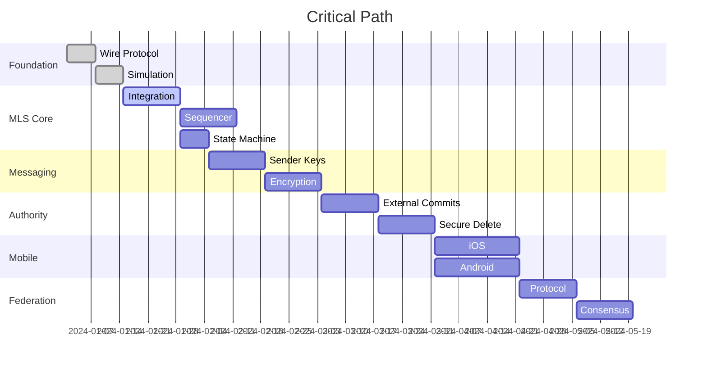

# Roadmap Document

## Phase 0: Foundation [Weeks 1-2]

### Objectives

Establish CI/CD, monorepo structure, deterministic simulation harness.

### Deliverables

```rust
// Workspace structure
kalandra/
├── Cargo.toml          // Workspace root
├── crates/
│   ├── kalandra-proto/   // Wire protocol types
│   ├── kalandra-server/  // Server implementation
│   ├── client-core/    // Client library
│   └── kalandra-harness/ // Simulation harness
└── tests/
    └── simulation/     // Deterministic tests
```

### Implementation Tasks

1. **Wire Protocol Types** [`kalandra-proto`]

```rust
// Core types with zero-copy design
#[repr(C, packed)]
pub struct FrameHeader {
   magic: u32,           // 0x53554E44 ("SUND")
   version: u8,          // 0x01
   flags: u8,
   opcode: u16,
   // ... routing fields ...
   signature: [u8; 64],
}

pub struct Frame {
   header: FrameHeader,  // Fixed 128 bytes, Raw Binary (Big Endian)
   payload: Bytes,       // Variable, CBOR-encoded
}

impl FrameHeader {
   const SIZE: usize = 128;

   pub fn from_bytes(data: &[u8]) -> Result<&Self>;
   pub fn to_bytes(&self) -> [u8; Self::SIZE];
}

impl Frame {
   pub fn from_wire(data: &[u8]) -> Result<Self>;
   pub fn to_wire(&self) -> Vec<u8>;
}
```

2. **Simulation Harness** [`kalandra-harness`]

```rust
#[test]
fn test_concurrent_proposals() {
   let mut sim = turmoil::Builder::new().build();

   // 5 clients send proposals simultaneously
   for i in 0..5 {
       sim.client(format!("client-{}", i), async {
           client.send_proposal().await
       });
   }

   sim.run();

   // Verify single commit with all proposals
   assert_eq!(sim.commits_count(), 1);
   assert_eq!(sim.commit(0).proposals.len(), 5);
}
```

### Success Metrics

- [ ] CI builds in <2 minutes
- [ ] Simulation passes with 50% packet loss
- [ ] Frame parsing at 1M msgs/sec
- [ ] Prototype Validated: Proof-of-concept showing NSE decrypting a message via PCEK without touching the MLS tree.

### Risks & Mitigations

- **Risk:** turmoil limitations  
  **Mitigation:** Fork and extend as needed

- **Risk:** Redb corruption under load.
  **Mitigation:** Abstract storage via Trait to allow swapping to LMDB/RocksDB if needed.

---

## Phase 1: MLS Core [Weeks 3-7]

### Objectives

Functional MLS group management without messaging.

### Deliverables

1. **MLS Integration**
   - OpenMLS or mls-rs integration
   - KeyPackage generation
   - Commit/Welcome processing

2. **Server Sequencer**

```rust
struct Sequencer {
   room_id: RoomId,
   epoch: AtomicU64,
   tree_hash: RwLock<[u8; 32]>,
   log: SegmentedLog,
}
```

3. **Client State Machine**

```rust
enum ClientState {
   Disconnected,
   PendingWelcome { welcome: Vec<u8> },
   Synchronized { epoch: u64 },
   PendingCommit { target_epoch: u64 },
}
```

### Benchmarks

```rust
#[bench]
fn bench_commit_processing(b: &mut Bencher) {
    // Target: <100ms for 1000 members
    let commit = generate_commit(1000);
    b.iter(|| process_commit(&commit));
}
```

### Success Metrics

- [ ] Create/join groups functional
- [ ] Tree hash convergence verified
- [ ] Commit processing <100ms @ 1K members

---

## Phase 2: Messaging Layer [Weeks 8-11]

### Objectives

Sender key derivation and message encryption.

### Implementation

1. **Sender Key Bridge**

```rust
fn derive_sender_key(epoch_secret: &[u8; 32]) -> SenderKey {
   let mut kdf = Hkdf::<Sha256>::new(None, epoch_secret);
   let mut key = [0u8; 32];
   kdf.expand(b"kalandraSenderV1", &mut key).unwrap();
   SenderKey(key)
}
```

2. **Message Encryption**
   - XChaCha20-Poly1305 implementation
   - Symmetric ratchet per sender
   - Zero-copy encryption path

3. **Cryptographic Erasure Pipeline**
   - Implement split storage (Key vs Payload)
   - Verify "shredding" (key deletion makes payload unrecoverable)

4. **Mobile PCEK Implementation**
   - Implement NotificationKey generation
   - Header extensions for push_keys

### Performance Requirements

- Encryption: <5ms per message
- Decryption: <3ms per message
- Throughput: 10K msgs/sec/room

---

## Phase 3: Server Authority [Weeks 12-16]

### Objectives

Moderation capabilities via External Commits.

### Implementation

1. **External Commit Generation**

```rust
impl Server {
   fn kick_member(&self, room: RoomId, target: LeafIndex) -> Result<()> {
       let commit = self.create_external_commit(
           Proposal::Remove(target)
       )?;
       self.broadcast_commit(commit)?;
       Ok(())
   }
}
```

2. **Secure Deletion**

```rust
fn secure_delete(log_index: u64) -> Result<()> {
   // 1. Delete the ephemeral key (Atomic)
   db.delete_key(log_index)?;
   // 2. (Optional) Reclaim payload space
   db.delete_payload(log_index)?;
   // 3. Verify key is gone
   assert!(db.get_key(log_index).is_none());
   Ok(())
}
```

### Validation

- Banned users cannot decrypt new messages
- Redacted content verified absent from disk
- Audit trail complete

---

## Phase 4: Mobile Implementation [Weeks 17-22]

### iOS Strategy

1. **Shared Key Cache**

```swift
// Main app exports keys
let keys = core.exportSenderKeys()
FileManager.default.write(keys, to: sharedContainer)

// NSE reads keys (low memory)
let keys = FileManager.default.read("keys.bin")
let plaintext = decrypt(envelope, keys[sender])
```

2. **Memory Budget**
   - Main App: Full MLS tree (2MB)
   - NSE: Keys only (50KB)

### Android Strategy

1. **Foreground Service**

```kotlin
class SyncService : ForegroundService() {
   override fun onStartCommand(): Int {
       wakeLock.acquire(5.minutes)
       processControlPlane()  // Priority
       processDataPlane()
       return START_STICKY
   }
}
```

### Success Metrics

- [ ] NSE memory <20MB under load
- [ ] 1000 notifications without crash
- [ ] Battery impact <2% per hour

---

## Phase 5: Federation [Weeks 23-26]

### Implementation

1. **Double-Signed Protocol**
   ... (Keep existing struct) ...

2. **Authority Handover**
   - "Stop-the-World" migration state
   - Handover Certificate generation
   - Read-only mode enforcement during transfer

### Validation

- Cross-domain messaging functional
- Authority transfer completes in <5s
- Federation lag <50ms

---

## Critical Path Analysis



---

## Risk Matrix

| Risk                   | Probability | Impact | Mitigation                            |
| ---------------------- | ----------- | ------ | ------------------------------------- |
| MLS complexity         | Medium      | High   | Use proven library, extensive testing |
| iOS memory limits      | High        | Medium | Shared key cache pattern              |
| Federation split-brain | Low         | High   | Authority consensus protocol          |
| Forensic leakage       | Medium      | High   | Secure deletion pipeline              |
| Performance regression | Medium      | Medium | Continuous benchmarking               |

---

## Testing Strategy

### Unit Tests

- 80% code coverage minimum
- Property-based testing for crypto

### Integration Tests

- Deterministic simulation
- Network partition scenarios
- Concurrent operation testing

### Performance Tests

```rust
#[bench]
fn bench_e2e_latency(b: &mut Bencher) {
    // Target: <100ms e2e
    b.iter(|| {
        client.send_message("test").await;
        server.receive().await;
    });
}
```

### Security Tests

- Fuzzing with AFL++
- Formal verification of core invariants
- Penetration testing

---

## Success Criteria

### Performance

- [ ] 10K msgs/sec/room sustained
- [ ] <100ms e2e latency (p99)
- [ ] <5ms encryption overhead

### Reliability

- [ ] 99.9% uptime
- [ ] Zero data loss
- [ ] Graceful degradation

### Security

- [ ] E2E encryption verified
- [ ] Forward secrecy confirmed
- [ ] PCS demonstrated

### Scalability

- [ ] 10K members per room
- [ ] 100K concurrent connections
- [ ] Linear scaling with cores

---

## Infrastructure

- CI/CD: GitHub Actions
- Testing: 8-core server
- Production: 3x 16-core servers
- Monitoring: Prometheus + Grafana

---

## Future Work

### Priority 1

- Post-quantum migration
- Hardware security module support
- Advanced moderation tools

### Priority 2

- Decentralized identity integration
- Cross-platform desktop clients
- Performance optimizations

### Priority 3

- Compliance certifications
- Enterprise features
- Global deployment

---

## References

1. MLS Implementation Guide: https://messaginglayersecurity.rocks/
2. TigerBeetle Testing: https://github.com/tigerbeetledb/tigerbeetle/tree/main/src/testing
3. Turmoil Simulation: https://github.com/tokio-rs/turmoil
4. QUIC Performance: https://www.fastly.com/blog/measuring-quic-vs-tcp
